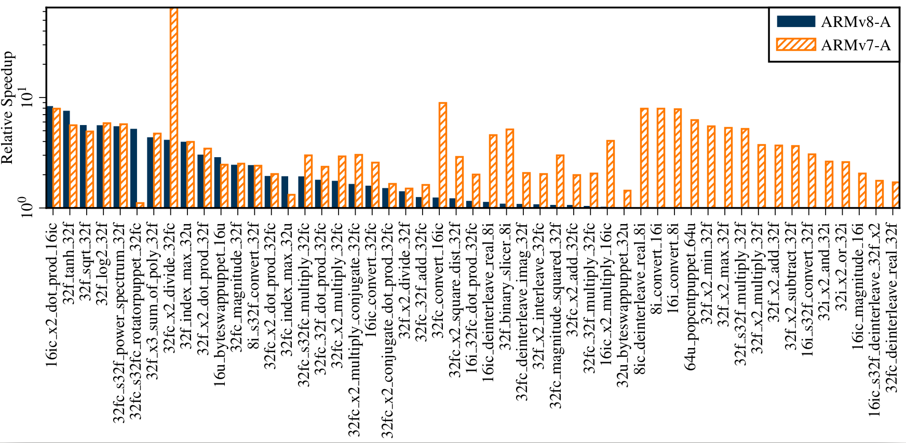

# Volk Profile for Android

This is an Android app that profiles the [Volk library](https://www.libvolk.org/) and selects the best implementations for the architecture, similar to `volk_profile` that comes as part of Volk. It is configured to run in *benchmark* mode, i.e., it will profile all kernels, even the ones without alternative implementations. Running the application generates two files:
- `volk_results.json` with benchmark results
- `volk_config` with the best implementations for the architecture

Files are stored on *External Storage* (which might be an SD card or some internal storage). The directory can be accessed when the phone is connected to a PC and is available to all applications on the phone that have the corresponding permission. This way apps that use Volk (like GNU Radio Android apps) can use it to select the implementations that perform best.

Volk comes with a [basic evaluation script](https://github.com/gnuradio/volk/blob/master/apps/plot_best_vs_generic.py) for the JSON file.

## Installation

Building the app requires the [GNU Radio Android toolchain](https://github.com/bastibl/gnuradio-android/). Please see this repository for further instructions on how to build the toolchain and apps that use it.

## Running the App

The app is minimalistic. There is only a button to start profiling and a textbox that indicates when it is done. You can use the `logcat` output to monitor progress.

## Exemplary Results

The following plot shows the speedup of unaligned implementations on a OnePlus 5T smartphone.

